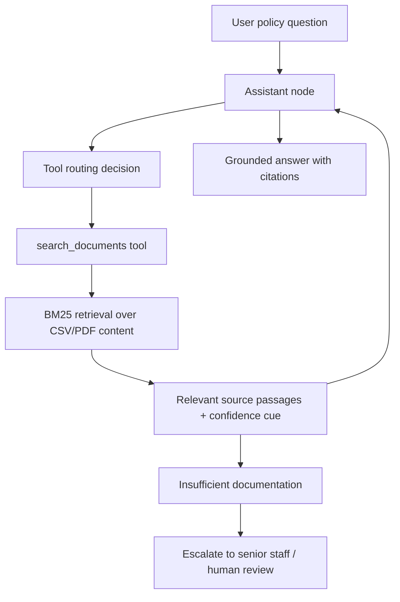

# Northbridge Policy Assistant

**A controlled RAG-based policy assistant that helps staff answer internal policy and operations questions with source grounding, confidence cues, and escalation boundaries.**

Northbridge Policy Assistant is an applied AI final project built to show how generative AI can support real business workflows without becoming an uncontrolled chatbot. The project uses retrieval-augmented generation, LangGraph-style tool routing, and a document search tool to answer questions from approved Northbridge materials.

## Business Problem

Policy, compliance, and operations teams often rely on internal manuals, memos, rosters, intake reports, and guidance documents to answer staff questions. When that review happens manually, organizations can run into:

- Slow turnaround when staff search across multiple documents.
- Inconsistent answers from person to person.
- Rework when key information is missed.
- Risk when unsupported assumptions are treated as facts.
- Poor escalation when documentation does not support a confident answer.

The goal of this project is to show how AI can assist with first-pass policy support while keeping human review and documented sources central to the workflow.

## Solution

Northbridge Policy Assistant uses a controlled retrieval workflow:

- Loads Northbridge CSV and PDF documents.
- Converts document content into searchable text chunks.
- Uses a BM25 retrieval tool to find relevant internal source material.
- Routes factual questions through the retrieval tool before answering.
- Returns answers with source references and confidence cues.
- Escalates when documentation is insufficient instead of inventing an answer.

The assistant is designed as a business workflow support tool, not a free-form chatbot.

## What This Demonstrates

- Applied AI workflow design.
- Retrieval-augmented generation (RAG).
- LangGraph tool-routing pattern.
- Structured document loading and chunking.
- Source-grounded answers.
- Confidence and escalation controls.
- Human-in-the-loop review boundaries.
- Business process automation for policy, compliance, and operations teams.

## System Architecture



## How It Works

1. The user asks a policy or operations question.
2. The assistant routes factual questions to the document search tool.
3. The retrieval layer searches internal CSV and PDF content.
4. Retrieved passages are returned with a confidence cue.
5. The assistant answers using retrieved source material.
6. If the documentation does not support an answer, the assistant escalates rather than guessing.

## Sample Input / Sample Output

**Sample input**

```text
What should staff do if a policy question is not clearly answered in the internal documents?
```

**Sample output**

```text
I do not have enough documentation to answer this accurately.
This should be escalated to senior staff.

Confidence: Low
```

For supported questions, the assistant returns a direct answer with source references from retrieved Northbridge documents.

## Limitations and Human Review

This project is a prototype and should not be treated as legal, compliance, insurance, or operational advice. It demonstrates workflow design and responsible AI controls.

Human review is required when:

- The retrieved documentation is weak or missing.
- The question involves sensitive policy interpretation.
- The answer could affect compliance, funding, operations, or stakeholder commitments.
- The assistant returns low confidence.

## Future Improvements

- Replace BM25 with vector embeddings for semantic retrieval.
- Add a persistent vector database such as ChromaDB.
- Add role-based access control for different staff groups.
- Add structured output for risk level, missing information, and next best action.
- Add audit logs for questions, retrieved sources, confidence levels, and escalation decisions.
- Add automated evaluation examples for supported, unsupported, and ambiguous questions.

## Repository Structure

```text
chat.py                         # Command-line RAG assistant
data/                           # Public sample CSV data
documents/                      # Public sample PDF materials
notebooks/                      # Prototype notebooks
src/prompts/system_prompt.txt   # Assistant instructions
src/tools/production_tool.py    # Small deterministic tool example
docs/system_design.md           # System design overview
docs/business_case.md           # Portfolio business framing
docs/evaluation_notes.md        # Evaluation and testing ideas
requirements.txt                # Python dependencies
```

## Run Locally

```bash
pip install -r requirements.txt
python chat.py
```

Create a local `.env` file if using the OpenAI-powered chat flow:

```text
OPENAI_API_KEY=your_key_here
```

Do not commit `.env` or API keys.

## Portfolio Note

This repository is presented as a hiring-manager-ready applied AI project. It highlights the system design choices behind a controlled AI workflow: source grounding, escalation behavior, and separation between LLM reasoning and workflow controls.
